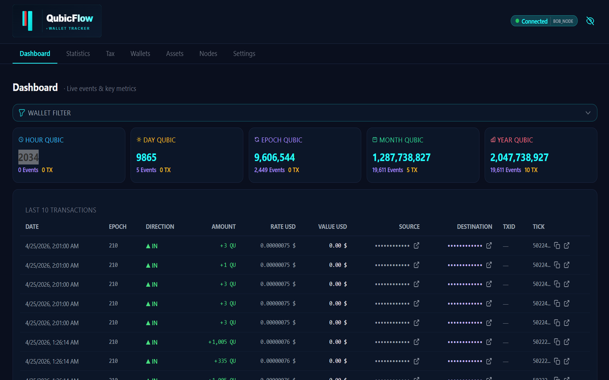
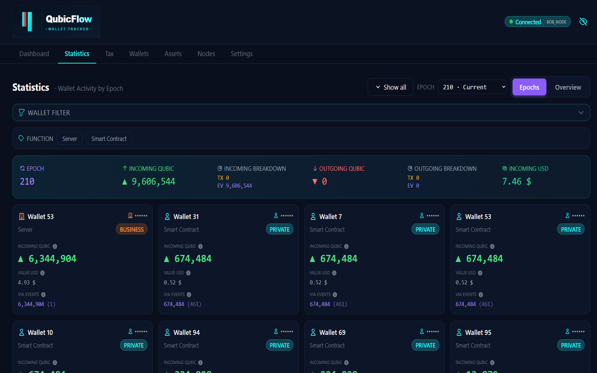
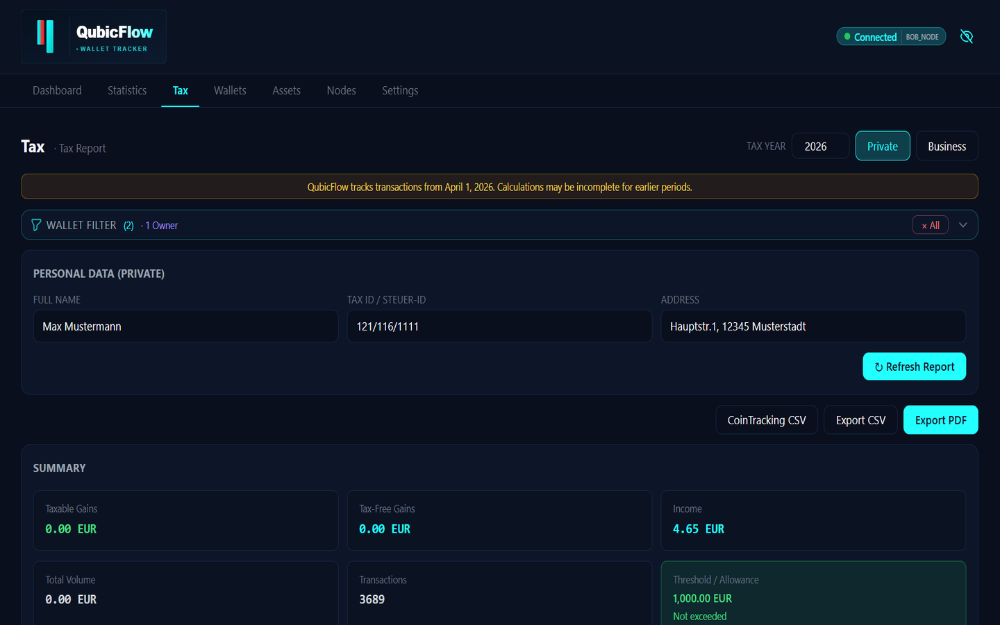

# QubicFlow — Umbrel Community App Store

Self-hosted wallet tracker and tax reporting tool for the [Qubic](https://qubic.org) blockchain network.



---

## Install on your Umbrel

### Step 1 — Add the Community App Store

1. Open your Umbrel device in the browser
2. Go to **App Store**
3. Tap the **⋮** menu (top right) → **Community App Stores**
4. Paste this URL and confirm:
   ```
   https://github.com/AndyQus/qubicflow-umbrel-store
   ```

### Step 2 — Install QubicFlow

5. Scroll down to the **Community** section in the App Store
6. Find **QubicFlow** and tap **Install**
7. Wait for the download and startup (~1–2 minutes)

### Step 3 — Open the App

8. Tap **Open** on the QubicFlow tile
9. The app opens in your browser at your Umbrel's local address

### First Setup

Once open, go to **Settings → Nodes** and add at least one Qubic node:

| Field | Value |
|-------|-------|
| URL | `https://rpc.qubic.org` |
| Type | `RPC` |
| Label | `Qubic RPC` |
| Priority | `1` |

Then go to **Wallets** → **Add Wallet** and enter your Qubic wallet address (60 uppercase letters).  
QubicFlow will start syncing your transaction history automatically.

### App Password (Backup Protection)

Umbrel automatically sets a password for the backup and restore endpoints.  
This password is managed by Umbrel and shown under **App Store → QubicFlow → Details**.  
No manual configuration required.

---

## Features

### Live Dashboard
Monitor all your Qubic wallets in real time. Incoming and outgoing events are displayed by hour, day, epoch, month and year as new ticks are confirmed on the network.



### Multi-Wallet Support
Add unlimited wallets and label them as Private or Business. Filter any view by wallet, owner or function.

### Tax Reporting Engine
Generate accurate tax reports for 14 countries:
`DE` `AT` `CH` `US` `GB` `AU` `CA` `FR` `NL` `IT` `ES` `PT` `SE` `NO`

Choose your cost-basis method — **FIFO, LIFO, HIFO or AVCO** — and let QubicFlow calculate taxable gains, tax-free gains and income automatically. Country-specific holding-period exemptions (e.g. Germany's 1-year rule) are applied automatically.



### Export Formats
- **CoinTracking CSV** — import directly into CoinTracking.info
- **Steuerberater CSV** — semicolon-separated format for German tax advisors
- **PDF Tax Report** — generated on your device, no external service needed

### Privacy by Design
All data stays on your Umbrel. Wallet addresses are masked in the UI by default. No telemetry, no cloud, no external accounts required.

---

## Requirements

- Umbrel OS (any device: Umbrel Home, Raspberry Pi, Linux VM)
- Internet access for Qubic network data

---

## Support

Found a bug or have a question? [Open an issue](https://github.com/AndyQus/qubicflow-umbrel-store/issues)

---

## Support QubicFlow

QubicFlow is free and will stay that way. If the app saves you time or helps with your taxes, a voluntary donation in Qubic is appreciated.

**Donation address:**
```
CCCJKFMDTUFFWDCRBFNHMQRYOBABEKBDUZWEJMARUETQPTFZWBCJLYUGREXI
```

Sending QU from one of your registered wallets automatically removes the support banner for the corresponding period:

| Amount | Duration |
|--------|----------|
| 1,000,000 QU | 1 month |
| 12,000,000 QU | 1 year |
| 100,000,000+ QU | Forever |

Your support funds: continued development, new features, user support, and time.

---

## More apps by AndyQus

- [MyLedger](https://myledger.qubic.tools) — Qubic Ledger Tool
- [Dividends](https://dividends.qubic.tools) — Dividend Tracker
- [Auctions](https://auctions.qubic.tools) — Qubic Auction Monitor
- [Doge](https://doge.qubic.tools) — Doge on Qubic
- [Explorer](https://live.qubic.org/explorer) — Qubic Live Explorer
- [Live](https://live.qubic.org) — Qubic Live Network
- [QPI Language Support](https://marketplace.visualstudio.com/items?itemName=AndyQus.qubic-org-qpi) — VSCode Extension

---

## Developer

Made by [AndyQus](https://github.com/AndyQus)
